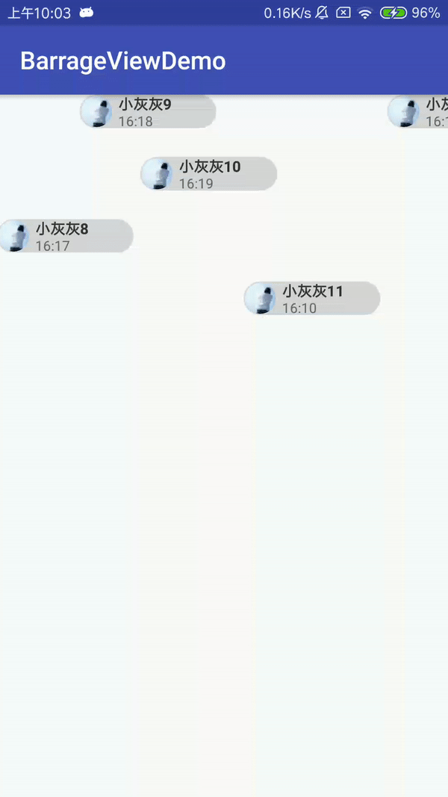

## Android属性动画弹幕，自定义弹幕布局 [CSDN](https://blog.csdn.net/u011106915/article/details/81584046) 

可配置项：

```
    barrageViews = new ArrayList<>();
    for (int i = 0; i < 20; i++) {
        barrageViews.add(new BarrageViewBean("小灰灰" + (i + 1), "16:1" + i % 10, "https://avatar.csdn.net/B/7/D/3_u011106915.jpg"));
    }
    barrageView.setData(barrageViews, new BarrageView.ViewHolder() {
        @Override
        public View getItemView(Context context, Object item, final int index) {
            return getItem(context, (BarrageViewBean) item, index);
        }
    });
    barrageView.setDisplayLines(30);//设置行数
    barrageView.setMinIntervalTime(200L);//设置最小显示间隔时间
    barrageView.setMaxIntervalTime(500L);//设置最大显示间隔时间
    barrageView.setAnimationTime(6000L);//设置弹幕持续时长
    barrageView.start();
```

## Demo 图片


